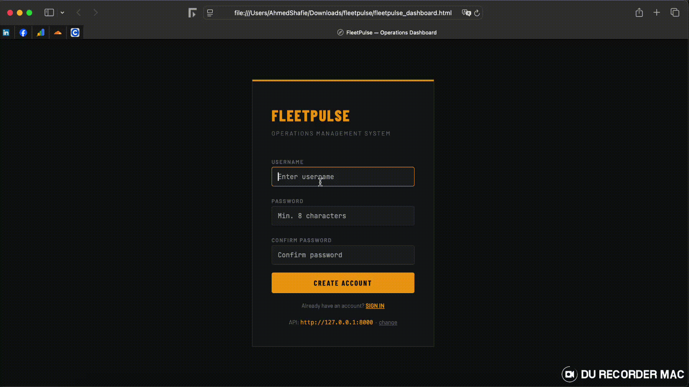
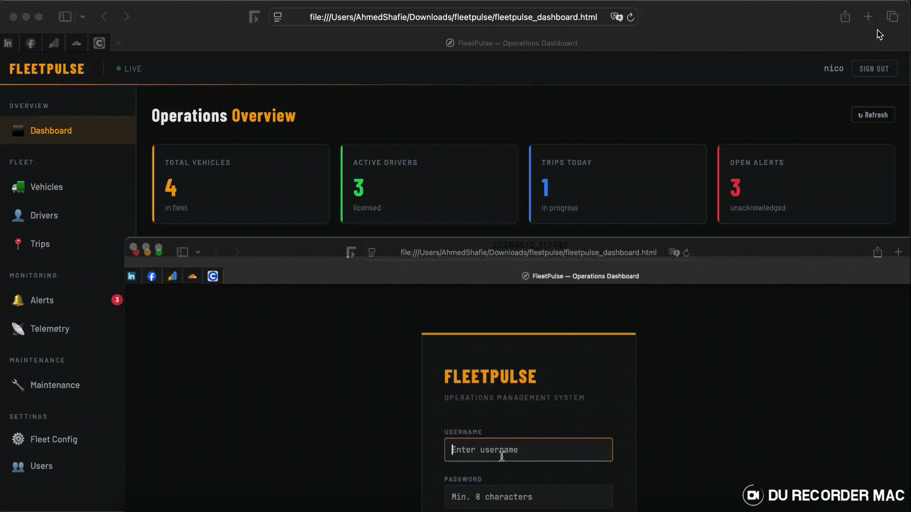
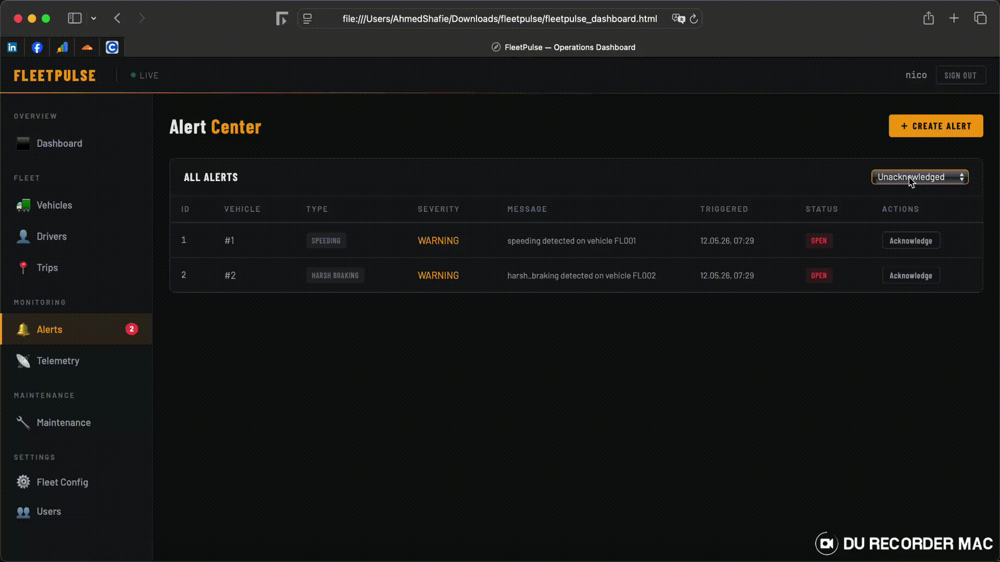
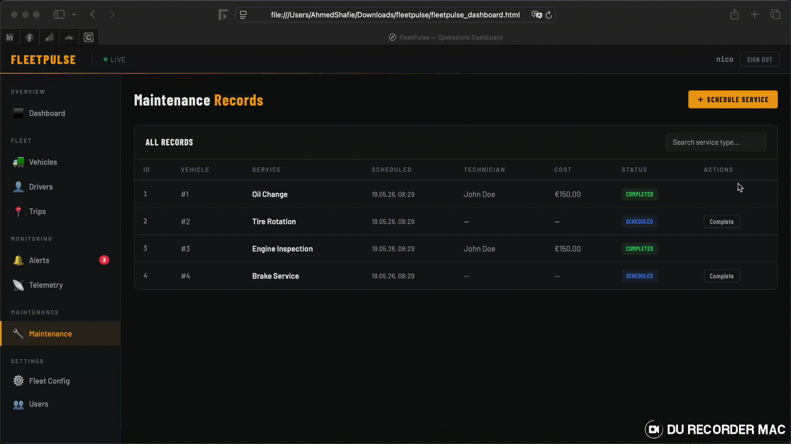

# FleetPulse 🚛

A FastAPI-based fleet management REST API with JWT authentication, real-time telemetry ingestion via MQTT, and full CRUD for vehicles, drivers, trips, alerts, and maintenance records.

---

## Project Structure

```
fleetpulse/
├── main.py                         # Uvicorn entry point
├── settings.toml                   # Dynaconf config (non-secret)
├── .secrets.toml                   # Dynaconf secrets (gitignored)
├── requirements.txt
│
├── restapi/
│   ├── __init__.py
│   ├── server.py                   # FastAPI app + router mounting
│   │
│   ├── core/
│   │   ├── __init__.py
│   │   ├── auth.py                 # JWT logic, password hashing, get_current_user
│   │   └── dependencies.py        # Shared FastAPI Depends
│   │
│   ├── db/
│   │   ├── __init__.py
│   │   ├── session.py              # SQLAlchemy engine + Session factory
│   │   └── models/
│   │       ├── __init__.py         # Re-exports all models
│   │       ├── base.py             # Base, BaseModel (.create(), .set_session())
│   │       ├── user.py
│   │       ├── vehicle.py
│   │       ├── driver.py
│   │       ├── trip.py
│   │       ├── telemetry.py
│   │       ├── alert.py
│   │       ├── maintenance.py
│   │       └── fleet_config.py
│   │
│   ├── schemas/                    # Pydantic schemas (request/response)
│   │   ├── __init__.py
│   │   ├── auth.py
│   │   ├── common.py
│   │   ├── drivers.py
│   │   ├── fleet_config.py         # FleetConfigSchema
│   │   ├── fleet_entities.py       # Trip, Telemetry, Alert, Maintenance
│   │   ├── tasks.py
│   │   ├── users.py
│   │   └── vehicles.py
│   │
│   └── api/
│       └── v1/
│           ├── __init__.py
│           └── routes/
│               ├── auth.py         # POST /api/v1/auth/login
│               ├── users.py        # GET /api/v1/users
│               │                   # POST /api/v1/users/password
│               ├── vehicles.py     # GET/POST /api/v1/vehicles
│               │                   # GET/PATCH/DELETE /api/v1/vehicles/{id}
│               ├── drivers.py      # GET/POST /api/v1/drivers
│               │                   # GET/PATCH/DELETE /api/v1/drivers/{id}
│               ├── trips.py        # GET/POST /api/v1/trips
│               │                   # GET/PATCH /api/v1/trips/{id}
│               ├── telemetry.py    # POST /api/v1/telemetry
│               │                   # GET /api/v1/telemetry?vehicle_id=&trip_id=
│               ├── alerts.py       # GET/POST /api/v1/alerts
│               │                   # POST /api/v1/alerts/{id}/acknowledge
│               ├── maintenance.py  # GET/POST /api/v1/maintenance
│               │                   # PATCH /api/v1/maintenance/{id}
│               └── fleet_config.py # GET/POST /api/v1/fleet-config
│                                   # GET /api/v1/fleet-config/active
│                                   # POST /api/v1/fleet-config/{ref}/activate
│                                   # DELETE /api/v1/fleet-config/{ref}
│
└── tests/
    ├── conftest.py                  # In-memory SQLite fixtures, TestClient
    ├── test_auth.py
    ├── test_users.py
    ├── test_vehicles.py
    ├── test_alerts.py
    ├── test_maintenance.py
    └── test_fleet_config.py
```

---

## Prerequisites

- Python 3.11+
- (Optional) MQTT broker such as [Mosquitto](https://mosquitto.org/) for live telemetry

---

## Installation

```bash
# 1. Clone the repo
git clone https://github.com/your-org/fleetpulse.git
cd fleetpulse

# 2. Create and activate a virtual environment
python -m venv .venv
source .venv/bin/activate        # Windows: .venv\Scripts\activate

# 3. Install dependencies
pip install -r requirements.txt
```

### `requirements.txt` (minimum)

```
fastapi>=0.111
uvicorn[standard]>=0.29
sqlalchemy>=2.0
pydantic[email]>=2.0
dynaconf>=3.2
python-jose[cryptography]>=3.3
passlib[bcrypt]>=1.7
python-multipart>=0.0.9
paho-mqtt>=2.0
pytest
httpx
```

---

## Configuration

Create a `settings.toml` in the project root:

```toml
[default]
PROJECT_NAME = "FleetPulse"
ACCESS_TOKEN_EXPIRE_MINUTES = 60
DATABASE_FILE = "fleetpulse.db"
ASSETS_DIR = "assets"
MQTT_BROKER_HOST = "localhost"
MQTT_BROKER_PORT = 1883
MQTT_TELEMETRY_TOPIC = "fleet/+/telemetry"
```

And a `.secrets.toml` (never commit this):

```toml
[default]
SECRET_KEY = "change-me-to-a-long-random-string"
```

---

## Running the Server

```bash
# Development (auto-reload)
uvicorn restapi.server:app --reload --port 8000

# Or via main.py if present
python main.py
```

The interactive API docs are available at:
- **Swagger UI**: http://localhost:8000/docs
- **ReDoc**: http://localhost:8000/redoc

---

## Authentication

All endpoints except `POST /api/v1/auth/login` require a Bearer token.

```bash
# 1. Obtain a token
curl -X POST http://localhost:8000/api/v1/auth/login \
  -d "username=admin&password=admin1234"

# Response
{ "access_token": "<jwt>", "token_type": "bearer" }

# 2. Use it
curl http://localhost:8000/api/v1/vehicles \
  -H "Authorization: Bearer <jwt>"
```

---

## API Overview

| Method | Endpoint | Description |
|--------|----------|-------------|
| POST | `/api/v1/auth/login` | Obtain JWT token |
| GET | `/api/v1/users` | List users |
| POST | `/api/v1/users/password` | Change own password |
| GET/POST | `/api/v1/vehicles` | List / create vehicles |
| GET/PATCH/DELETE | `/api/v1/vehicles/{id}` | Read / update / delete vehicle |
| GET/POST | `/api/v1/drivers` | List / create drivers |
| GET/PATCH/DELETE | `/api/v1/drivers/{id}` | Read / update / delete driver |
| GET/POST | `/api/v1/trips` | List / start trips |
| GET/PATCH | `/api/v1/trips/{id}` | Read / update trip |
| POST | `/api/v1/telemetry` | Ingest a telemetry point |
| GET | `/api/v1/telemetry` | Query telemetry (vehicle_id, trip_id) |
| GET/POST | `/api/v1/alerts` | List / create alerts |
| POST | `/api/v1/alerts/{id}/acknowledge` | Acknowledge an alert |
| GET/POST | `/api/v1/maintenance` | List / create maintenance records |
| PATCH | `/api/v1/maintenance/{id}` | Update maintenance record |
| GET/POST | `/api/v1/fleet-config` | List / create fleet configs |
| GET | `/api/v1/fleet-config/active` | Get active config |
| POST | `/api/v1/fleet-config/{ref}/activate` | Activate a config |
| DELETE | `/api/v1/fleet-config/{ref}` | Delete inactive config |

---

## Features & Demo

### Overview


Full-featured fleet management dashboard with real-time monitoring, comprehensive vehicle tracking, and centralized operations control. Intuitive UI displays all fleet metrics at a glance with live status indicators.

---

### User Registration


Seamless account creation with form validation. Users can quickly register with username and password, with automatic validation feedback. New accounts are instantly ready to use with auto-login functionality for immediate access.

---

### User Login


Secure JWT-based authentication system. Enter credentials to obtain access token and unlock full dashboard access. Session persists with Bearer token in Authorization header for secure API communication.

---

### Vehicle Management


Effortlessly manage your fleet inventory. Add new vehicles with VIN validation, license plate, make/model, fuel type, and odometer reading. View all vehicles in sortable tables with real-time status updates. Edit or remove vehicles as needed with instant database persistence.

---

### Driver Management


Comprehensive driver profiles with complete license information. Register drivers with contact details, license number, and expiry date tracking. Maintain full driver database for compliance and assignment to trips.

---

### Trip Management


Real-time trip tracking from start to completion. Initiate trips with vehicle and optional driver assignment, record distance and fuel consumption, track max/avg speed metrics. Complete trips with accurate data for comprehensive reporting and analytics.

---

### Alert Monitoring


Intelligent alert system for fleet safety and compliance. Create and monitor alerts for speeding, geofencing violations, low fuel, harsh braking, and idle time. Multiple severity levels (info, warning, critical) for prioritized responses.

---

### Alert Management


Advanced alert filtering and acknowledgment capabilities. Sort and filter alerts by severity and type, quickly acknowledge resolved issues to maintain clean alert dashboard and operational visibility.

---

### Telemetry Data


Real-time telemetry ingestion from vehicle sensors. Post GPS coordinates, speed, fuel levels, ignition status, and engine diagnostics to the API. Stream continuous data for monitoring and analysis.

---

### Telemetry Analytics


Query and analyze historical telemetry data. Filter telemetry by vehicle or trip ID to review performance metrics, driving patterns, and vehicle health. Export data for detailed analytics and reporting.

---

### Maintenance Scheduling


Proactive maintenance management system. Schedule services with technician assignment, cost tracking, and service type classification. Monitor maintenance status and plan preventive maintenance intervals to maximize fleet uptime and reduce downtime.

---

### Fleet Configuration


Centralized fleet policies and operational settings. Configure speed limits, idle alert thresholds, and fuel warnings globally across fleet. Apply different configurations for various fleet segments and activate configurations as operational needs change.

---

## Running Tests

Tests use an in-memory SQLite database — no setup needed.

```bash
# Run all tests
pytest

# With verbose output
pytest -v

# Run a specific module
pytest tests/test_vehicles.py -v
```

The `conftest.py` fixture automatically:
1. Spins up an in-memory SQLite DB
2. Creates all tables via `Base.metadata.create_all`
3. Creates an `admin` user
4. Logs in and injects the Bearer token into the `TestClient`
5. Rolls back every transaction after each test for full isolation

---

## License

MIT
